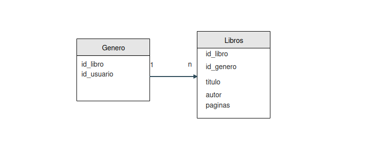

# TPE 1
La idea es tener una libreria, por lo que nuestra DB va a tener Usuarios y Libros, y cada libro puede tener una puntuación. Ademas, el usuario va a poder guardar sus libros favoritos en una tabla llamada biblioteca.

## Diagrama



## Relaciones entre tablas:

***Relaciones entre Biblioteca, Usuarios, y Libros:***

```sql
ALTER TABLE `Biblioteca`
ADD CONSTRAINT `fk_Biblioteca_Usuarios`
FOREIGN KEY (`id_usuario`)
REFERENCES `Usuarios`(`id_usuario`) 
ON DELETE RESTRICT ON UPDATE RESTRICT;


ALTER TABLE `Biblioteca`
ADD CONSTRAINT `fk_Biblioteca_Libros`
FOREIGN KEY (`id_libro`)
REFERENCES `Libros`(`id_libro`) 
ON DELETE RESTRICT ON UPDATE RESTRICT;
```

***Relaciones entre Puntuacion, Usuarios, y Libros:***
```sql
ALTER TABLE `Puntuacion`
ADD CONSTRAINT `fk_Puntuacion_Usuarios`
FOREIGN KEY (`id_usuario`)
REFERENCES `Usuarios`(`id_usuario`) 
ON DELETE RESTRICT ON UPDATE RESTRICT;

ALTER TABLE `Puntuacion`
ADD CONSTRAINT `fk_Puntuacion_Libros`
FOREIGN KEY (`id_libro`)
REFERENCES `Libros`(`id_libro`) 
ON DELETE RESTRICT ON UPDATE RESTRICT;
```

## Participantes

- Agustin Pereira
- Sebastian Ulibarri
